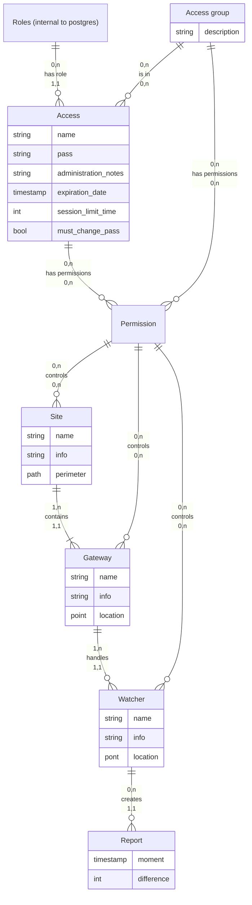

# Merise schemas

Note : this document contains diagrams declared in the mermaid js format and is reccomended to be visualised with a compatible tool.

## MCD (Conceptual Data Model)

```mermaid
erDiagram
    "Roles (internal to postgres)" || --o{ Access : "0,n
        has role
        1,1
    "
    "Access group" ||--o{ Access : "0,n
        is in
        0,n
    "
    "Access group" ||--o{ Permission : "0,n
        has permissions
        0,n
    "
    Access ||--o{ Permission : "0,n
        has permissions
        0,n
    "
    Permission ||--o{ Site : "0,n
        controls
        0,n
    "
    Permission ||--o{ Gateway : "0,n
        controls
        0,n
    "
    Permission ||--o{ Watcher : "0,n
        controls
        0,n
    "
    Site ||--|{ Gateway : "1,n
        contains
        1,1
    "
    Gateway ||--o{ Watcher : "1,n
        handles
        1,1
    "
    Watcher ||--o{ Report : "0,n
        creates
        1,1
    "
    "Access group" {
        string description
    }
    Access {
        string name
        string pass
        string administration_notes
        timestamp expiration_date
        int session_limit_time
        bool must_change_pass
    }
    Site {
        string name
        string info
        path perimeter
    }
    Gateway {
        string name
        string info
        point location
    }
    Watcher {
        string name
        string info
        pont location
    }
    Report {
        timestamp moment
        int difference
    }
```

## 